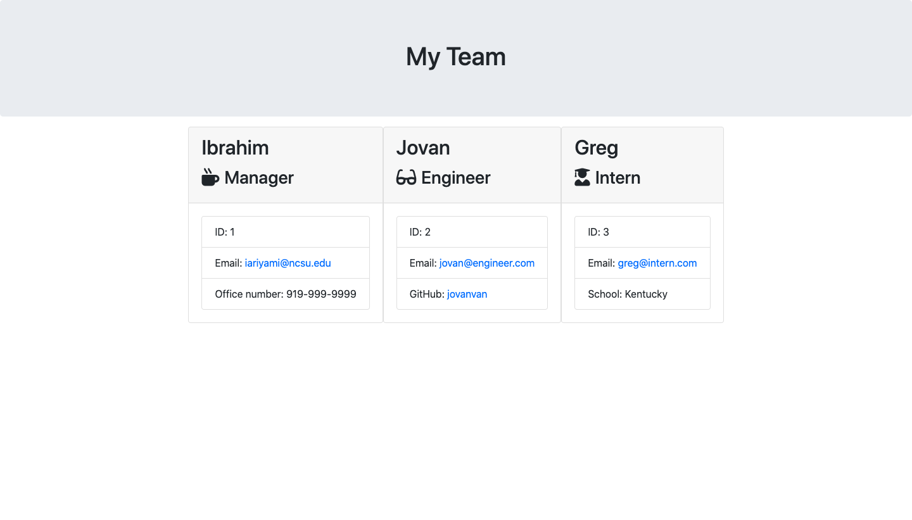

# Team Profile Generator
* The team profile generator is a CLI based application that the user to input employee information and display it on an html page.

# Table of Contents

* [Description](#description)
* [Links](#links)
* [Purpose](#purpose)
* [Contributors](#contributors)
* [Contact](#contact)
* [Credits](#credits)

# **Description**
* The team profile generator uses inquirer for the questions that it prompts, fs writefile to send the information to the html page, javascript files for each class, and different html templates for specific employee information.

* Screenshot of Deployed Application:

# **Links**
* Github Overview: https://github.com/iariyami/team-profile-generator

* Video Demo: https://drive.google.com/file/d/1T4_xOgATZoAekfAKANtTopS1FQ-_3xEe/view

# **Purpose**
* The purpose of this application was to be able to create an easy understand visual for an organization to view a team.

# **Contributors**
* Ibrahim Riyami

# **Contact**
* https://github.com/iariyami

* iariyami@ncsu.edu

# **Credits**
* https://www.npmjs.com/package/inquirer

* https://nodejs.org/api/modules.html